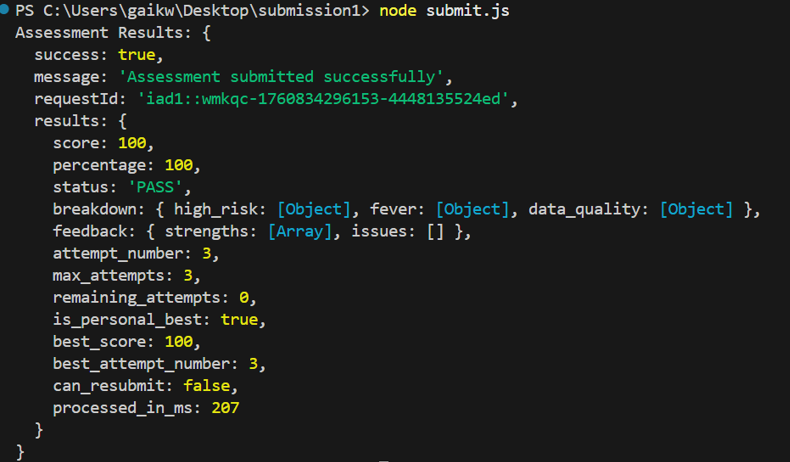

# 🧠 Ksense Technology Assessment
**Mid-Level Full Stack TypeScript Developer Challenge**  
by **Sachi Jagannath Gawai**  

This project implements a patient risk-scoring API built with **TypeScript**, **Express**, and **Axios**.  
It connects to Ksense’s simulated healthcare dataset, processes patient vitals, and computes a **risk score** using medical logic for blood pressure, temperature, and age.  

The API also identifies high-risk and fever patients, flags missing or invalid data, and handles rate-limited paginated requests gracefully.

---

## 🚀 Features
- Fetches paginated patient data from Ksense API  
- Retry and exponential back-off logic for rate limiting  
- Calculates total risk score for each patient  
- Returns alert lists for:  
  - **High-Risk Patients:** risk ≥ 4  
  - **Fever Patients:** temperature ≥ 99.6 °F  
  - **Data Quality Issues:** missing or malformed data  
- Written fully in **TypeScript** with clean modular functions  

---

## 🧩 Tech Stack
| Layer | Technology |
|--------|-------------|
| Backend | Node.js, Express |
| Language | TypeScript |
| HTTP Client | Axios |
| Tooling | Nodemon, ts-node |
| API Testing | Postman |
| Package Manager | npm |


---

## ⚙️ Setup Instructions

### 1. Clone this repository
```bash
git clone https://github.com/<your-username>/ksense-assessment.git
cd ksense-assessment
```

### 2. Install dependencies
```bash
npm install
```

### 3. Run the server
```bash
npm run dev
```

### 4. Expected console output
```
🚀 Server running on http://localhost:4000
✅ Page 1 fetched successfully
✅ Page 2 fetched successfully
...
```


---

## 🧮 Risk Scoring Rules

| Category | Condition | Points |
|-----------|------------|--------|
| **Blood Pressure** | ≥ 140 / ≥ 90 | 3 |
|                   | 130–139 / 80–89 | 2 |
|                   | 120–129 / < 80 | 1 |
|                   | < 120 / < 80 | 0 |
| **Temperature**   | ≥ 101.0 °F | 2 |
|                   | 99.6–100.9 °F | 1 |
|                   | ≤ 99.5 °F | 0 |
| **Age**           | > 65 | 2 |
|                   | 40–65 | 1 |
|                   | < 40 | 0 |

**Total Risk Score = BP + Temperature + Age**

---


## 🧰 Troubleshooting

| Issue | Solution |
|--------|-----------|
| **Rate limit hit** | Wait 10–15 seconds between runs. The API intentionally throttles frequent calls. |
| **500 Server Error** | Confirm your `x-api-key` is valid. |
| **TypeScript error TS18046** | This project already fixes it by declaring `err` as `any`. |

---

## 🧾 Project Structure
```
ksense-assessment/
│
├── src/
│   └── index.ts            # backend logic
├── submission1/
│   └── submit.js            # Output
├── package.json            # dependencies & scripts
├── tsconfig.json           # TypeScript compiler settings
└── README.md               # documentation
```

## Score 


---



## Summary

---

This project was a great opportunity to demonstrate both backend engineering and system reliability skills under real-world API constraints.


```
